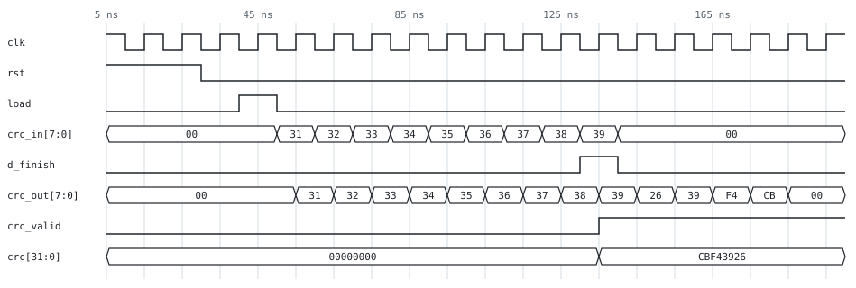
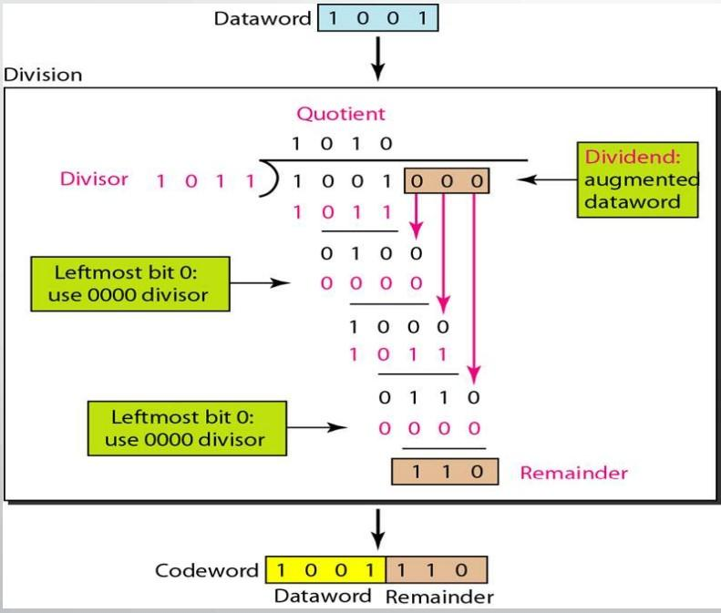
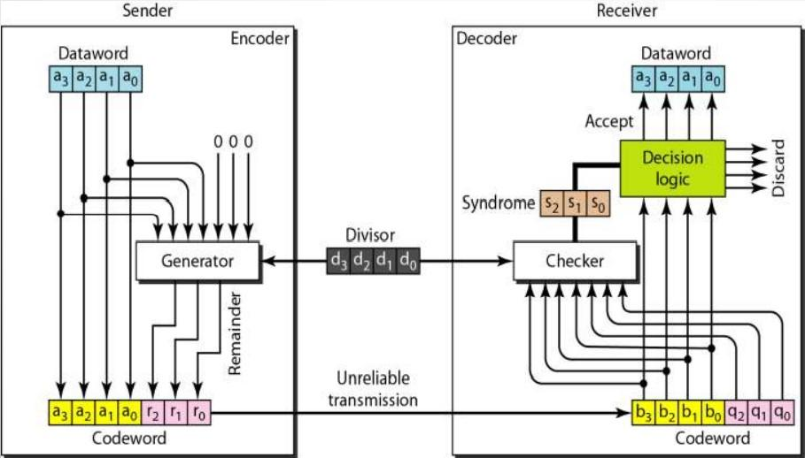
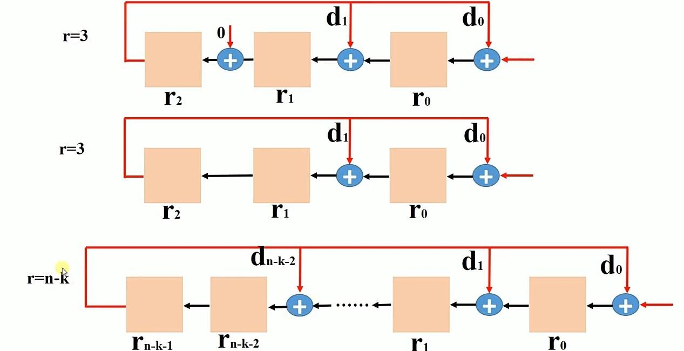
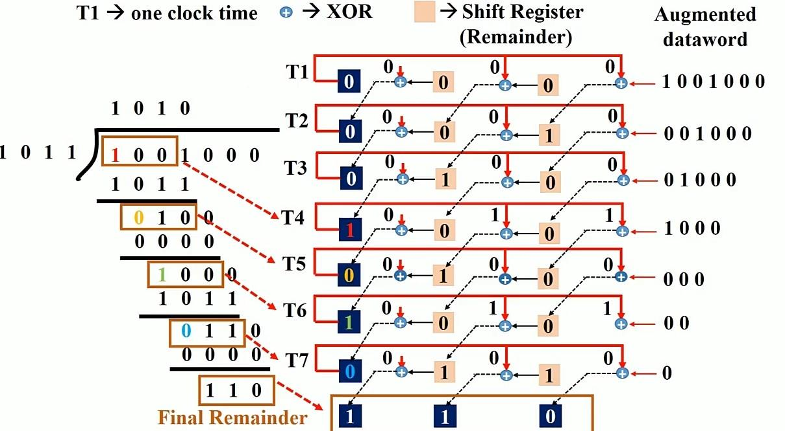
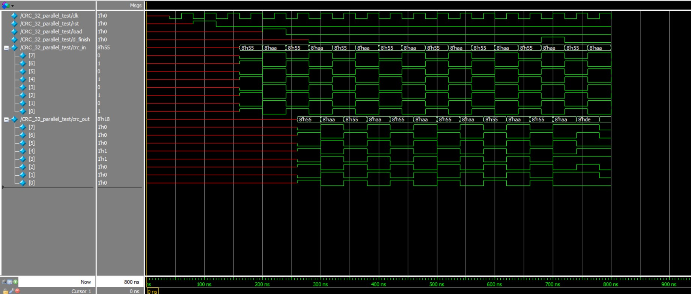

# CRC-32 Generator in Verilog: Serial and Byte-Parallel

Two synthesizable CRC-32 generators (polynomial `0x04C11DB7`), checked bit for bit against a Python golden model:

- **`crc32_serial`** is a 32-bit LFSR that takes **1 bit per clock**.
- **`crc32_parallel`** unrolls eight LFSR steps into one XOR network and takes **8 bits per clock**.

Both cores are parameterised in the standard Rocksoft model (`INIT`, `REFIN`, `REFOUT`, `XOROUT`). One design therefore covers the Ethernet/zlib CRC-32 and the other common 32-bit variants. The default configuration gives the reference check value `CRC-32("123456789") = 0xCBF43926`.

| | |
|---|---|
| **Verification** | Self-checking Icarus Verilog testbenches cover 2 designs × 5 CRC variants × 210 frames. Every output bit is compared with the Python model. |
| **Testbench strength** | Mutation-tested: all 7 deliberately injected RTL bugs are detected. |
| **Golden model** | Agrees with Python's `zlib.crc32` / `binascii.crc32` and with the published check values for all 5 variants. |
| **Synthesis** | Yosys `synth_xilinx`: parallel ≈ 138 LUTs + 78 FFs, serial ≈ 76 LUTs + 74 FFs. |



*`crc32_parallel` hashing the ASCII string `"123456789"` (bytes `31`–`39`), simulated with Icarus Verilog and drawn with `python/wave_svg.py`. `crc` holds the standard check value `CBF43926` on the clock that takes the last byte. The next four clocks append it to the output stream, least-significant byte first as Ethernet does (`26 39 F4 CB`).*

---

## How a CRC works

A CRC treats the message as a polynomial over GF(2). It divides the message by a fixed generator polynomial and appends the remainder as a check value. The receiver repeats the division. A non-zero or unexpected remainder means the data was corrupted in transit. CRC-32 detects every single-bit error, every double-bit error, any odd number of bit errors, and every burst error up to 32 bits long.

<p align="center">
  
  
</p>

*Left: the encoder divides the dataword padded with zeros, and the remainder becomes the check bits. Right: the sender/receiver structure.*

### From long division to a shift register

Division modulo 2 is just shifting and XOR, so it maps directly onto a **linear-feedback shift register (LFSR)**. It uses one flip-flop per remainder bit, plus an XOR gate wherever the generator polynomial has a `1`.

<p align="center">
  
</p>

<p align="center">
  
</p>

*One remainder computed clock by clock: every clock of the LFSR performs one step of the long division on the left.*

The figures show the textbook *augmented* form, where the message is padded with `r` zeros and fed in at the low end. This RTL uses the equivalent **direct form**: each incoming bit is XORed with the bit leaving the top of the register. That produces the same remainder without the extra 32 padding clocks.

## Architecture

### Serial: `rtl/crc32_serial.v`

```verilog
wire        feedback = crc_reg[31] ^ crc_in;
wire [31:0] next_crc = {crc_reg[30:0], 1'b0} ^ (feedback ? 32'h04C11DB7 : 32'h0);
```

The register uses 32 flip-flops with an XOR tap wherever the polynomial `x³² + x²⁶ + x²³ + x²² + x¹⁶ + x¹² + x¹¹ + x¹⁰ + x⁸ + x⁷ + x⁵ + x⁴ + x² + x + 1` has a term. It is small, but throughput is only one bit per clock.

### Byte-parallel: `rtl/crc32_parallel.v`

Eight clocks of the serial LFSR collapse into one combinational function of the current register `c` and the input byte `d`, because the whole operation is linear over GF(2). Each next-state bit is an XOR of at most 14 inputs, for example:

```verilog
assign next_crc[0]  = c[24] ^ c[30] ^ d[0] ^ d[6];
assign next_crc[31] = c[23] ^ c[29] ^ d[5];
```

`python/crc32_model.py` derives this XOR matrix from the serial model by feeding one basis vector at a time, and prints the Verilog with `make equations`. A test parses the equations back out of the RTL and checks them against the derivation, so a typo in any of the 32 lines fails the test suite.

### Control FSM and interface

Both cores share a three-state FSM, `IDLE → COMPUTE → FINISH → IDLE`:

| Port | Dir | Width (serial / parallel) | Function |
|---|---|---|---|
| `clk`, `rst` | in | 1 | Clock; synchronous active-high reset |
| `load` | in | 1 | One-cycle pulse in `IDLE` starts a frame |
| `crc_in` | in | 1 / 8 | Message data, one bit or byte per clock in `COMPUTE` |
| `d_finish` | in | 1 | High together with the last bit or byte of the frame |
| `crc_out` | out | 1 / 8 | Codeword stream: the message echoed one clock late, then the 32 CRC bits |
| `crc` | out | 32 | Final CRC, updated on the clock that takes the last bit or byte |
| `crc_valid` | out | 1 | `crc` holds a finished result; cleared by the next `load` |

A new frame can start on the clock right after the last CRC bit or byte, with no reset needed between frames.

### Supported CRC-32 variants

| Variant | `INIT` | `REFIN` / `REFOUT` | `XOROUT` | `CRC("123456789")` | Used by |
|---|---|---|---|---|---|
| **CRC-32/ISO-HDLC** (default) | `FFFFFFFF` | 1 / 1 | `FFFFFFFF` | `CBF43926` | Ethernet, zlib, PNG, gzip |
| CRC-32/BZIP2 | `FFFFFFFF` | 0 / 0 | `FFFFFFFF` | `FC891918` | bzip2, ATM AAL5 |
| CRC-32/MPEG-2 | `FFFFFFFF` | 0 / 0 | `00000000` | `0376E6E7` | MPEG-2 transport streams |
| CRC-32/JAMCRC | `FFFFFFFF` | 1 / 1 | `00000000` | `340BC6D9` | ISO-HDLC without the final inversion |
| RAW | `00000000` | 0 / 0 | `00000000` | `89A1897F` | Plain remainder, as computed by the original design |

In the serial core the bit order is set by the sender. For reflected variants, send each byte LSB-first.

## Verification

The testbenches don't just check that the outputs look plausible. Every expected value comes from an independent Python model.

1. **Golden model (`python/crc32_model.py`)**: a bit-accurate model of both architectures. It is checked against `zlib.crc32` / `binascii.crc32` on random data and against the catalogue check value of every variant.
2. **Vector generation (`python/sim.py`)** writes the test frames and their expected CRCs. There are 10 directed cases (the check string, single bytes, all-zero and all-one runs, `00..FF`, the original ModelSim stimulus) plus 200 random frames of 1 to 64 bytes.
3. **Self-checking testbenches (`tb/`)** send all 210 frames back to back with random 0–3 cycle gaps and no reset in between. They check:
   - every echoed message bit or byte
   - every appended CRC bit or byte, in the correct order
   - `crc` / `crc_valid`
   - that the FSM has returned to `IDLE`.
4. **Codeword property**: the model confirms that running the CRC over *message + appended CRC* always gives the same residue (`0x2144DF1C` for Ethernet). This is how a real receiver checks a frame.

```text
$ make sim
[PASS] parallel CRC-32/ISO-HDLC
[PASS] parallel CRC-32/BZIP2
...
[PASS] serial   RAW

$ make test
34 passed
```

**Are the testbenches strong enough?** To check, I injected bugs into the RTL, and every one was caught:

| Injected bug | Result |
|---|---|
| Serial: original CRC-16-style feedback taps | FAIL, 3549 mismatches |
| Serial: shift out 31 CRC bits instead of 32 | FAIL, 102 mismatches |
| Serial: `count` not cleared between frames | FAIL, 31631 mismatches |
| Parallel: original stuck `count` (FSM never leaves `FINISH`) | FAIL, 8135 mismatches |
| Parallel: one extra term in one XOR equation | FAIL, 1016 mismatches |
| Parallel: CRC bytes sent in the wrong order | FAIL, 831 mismatches |
| Parallel: register not re-initialised between frames | FAIL, 1039 mismatches |

### Reproducing the original ModelSim result



*The original course simulation (ModelSim) fed `55 AA` six times into the zero-initialised parallel design, and `crc_out` shows `DE`, `18` as the first CRC bytes.*

The Python model computes `RAW CRC(55 AA × 6) = 0xDE18D318`, which matches that screenshot. The original RTL, re-simulated in Icarus, gives the same bytes. So the model, the original simulation and the new RTL all agree on the datapath. `test_original_modelsim_capture_is_reproduced` keeps that result pinned as a regression test.

## Synthesis

Yosys `synth_xilinx` (7-series; the Spartan-6 mapping gives the same counts), from `make synth`:

| Design | LUTs | Flip-flops | Other | Bits per clock |
|---|---|---|---|---|
| `crc32_serial` | 76 | 74 | 2 × CARRY4 | 1 |
| `crc32_parallel` | 138 | 78 | — | 8 |

For 8× the throughput, the parallel core costs roughly 1.8× the LUTs. The flip-flop counts include the 32-bit `crc` output register and the `crc_out` echo stage. These are Yosys estimates. Vivado or ISE results will differ somewhat, and timing (Fmax) has not been measured yet.


## Repository layout

```text
rtl/
  crc32_serial.v          1 bit/clock LFSR core
  crc32_parallel.v        8 bits/clock unrolled core
tb/
  tb_crc32_serial.v       self-checking testbench (vector-driven)
  tb_crc32_parallel.v     self-checking testbench (vector-driven)
python/
  crc32_model.py          golden model, variant table, XOR-equation derivation
  sim.py                  writes vectors, runs Icarus for each design/variant
  test_crc32.py           pytest suite: model, RTL equations, RTL simulation
  wave_svg.py             renders the README waveform from a VCD
docs/images/              figures and waveforms
```

## Running it

Requirements: Python 3.9+, [Icarus Verilog](https://steveicarus.github.io/iverilog/) and, for synthesis, [Yosys](https://github.com/YosysHQ/yosys).

```bash
# macOS:          brew install icarus-verilog yosys
# Debian/Ubuntu:  sudo apt install iverilog yosys
pip install -r requirements.txt

make test        # everything: model checks + RTL simulation of all variants
make sim         # RTL simulation only, one PASS/FAIL line per design/variant
make waves       # VCDs in build/ (open with GTKWave) + regenerate the README waveform
make synth       # Yosys resource report
python3 python/crc32_model.py "hello"   # CRC of any string in every variant
```

## Credits and license

Licensed under the [CERN Open Hardware Licence v2, Weakly Reciprocal](LICENSE) (CERN-OHL-W-2.0), the same licence as the upstream project. Modified source files say what was changed at the top.
